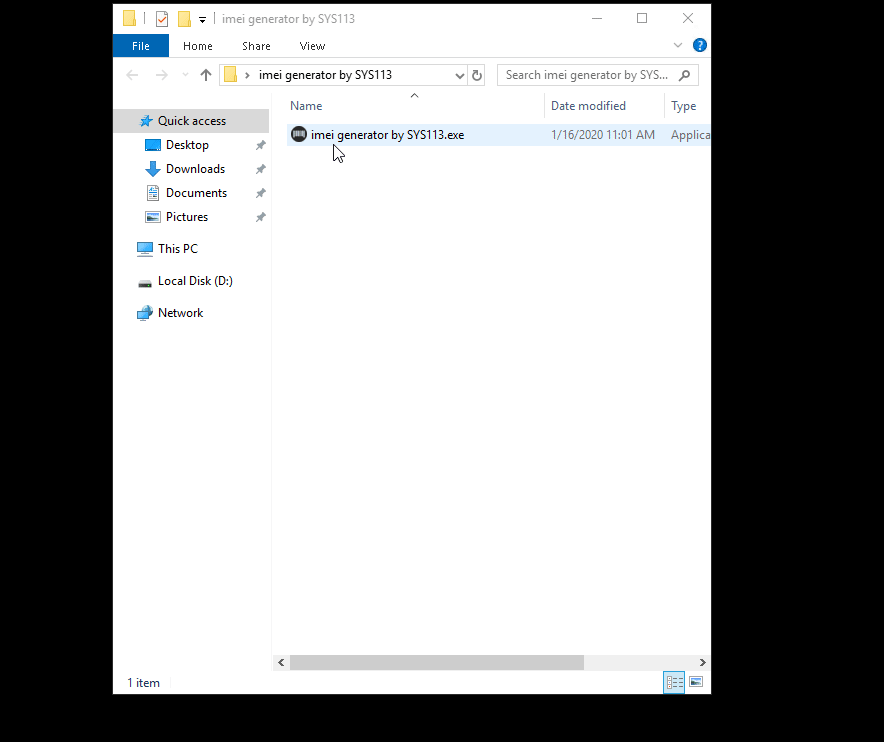

---

  

---
> ## *download*

--------------------------------------------------

> ## *use*
> *1. open imei-generator* 
> *2. enter the default imei range numbers in 'default range' input ...* 
> *3. the serial numbers required , enter in 'how many' input ...* 
> *4. press 'generate' button ...* 
> *5. finish , show imei's ;D* 

--------------------------------------------------
> ## *a example of use*

